# Machanic Site

This project contains various logical constructions, developments in the languages of web technologies

## calcAdd&MultiPropab.html
### Description
This is a page where you can solve the most frequently problematic topic in probability theory
### Screenshot

## calendar.html
### Description
This is a calendar page
### Screenshot
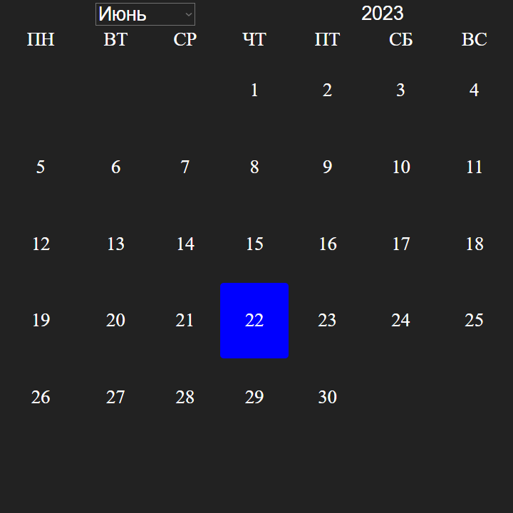

## Christmas.html
### Description
This is a page with a New Year's theme mode
### Screenshot

## contentHeading.html
### Description
This page c collects all the headings and puts them in the content (some kind of dynamism)
### Screenshot
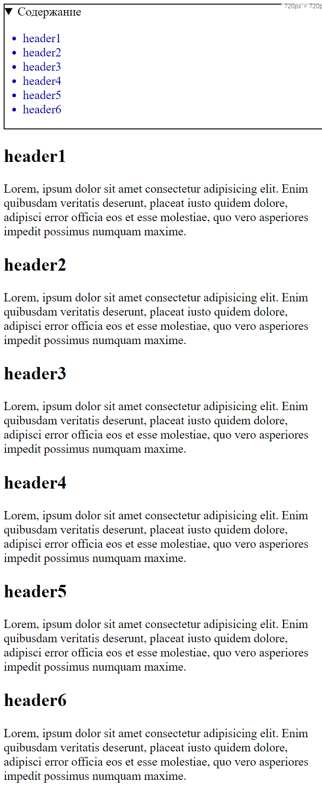

## draggableItem.html
### Description
This is a page where you can move an element around the page (development for projects where it may be necessary)
### Screenshot
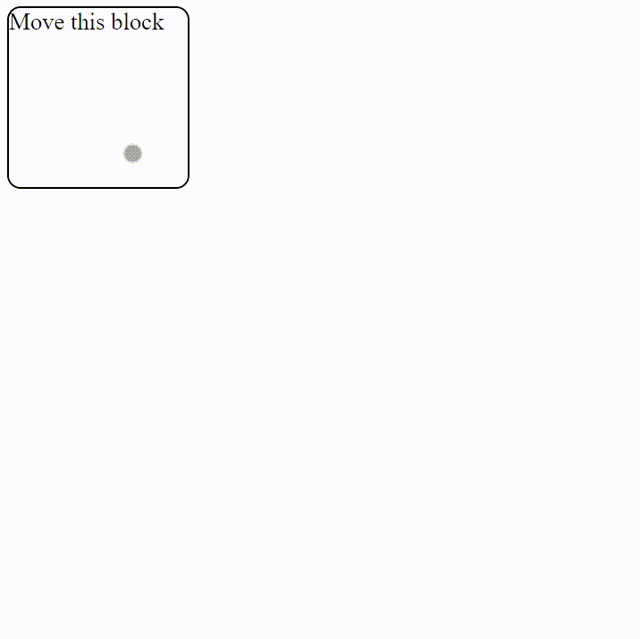

## easyCalc.html
### Description
This is a page with a simple calculator that can be opened on any device (it performs the usual mathematical operations [+, -, *, /, %, ^]
### Screenshot
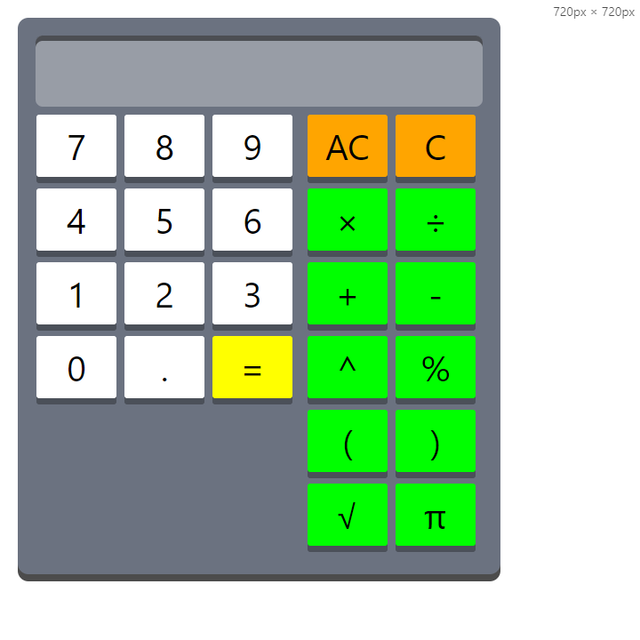

## movedList.html
### Description
This is a page in which the list moves to the right when hovering (some kind of animation)
### Screenshot
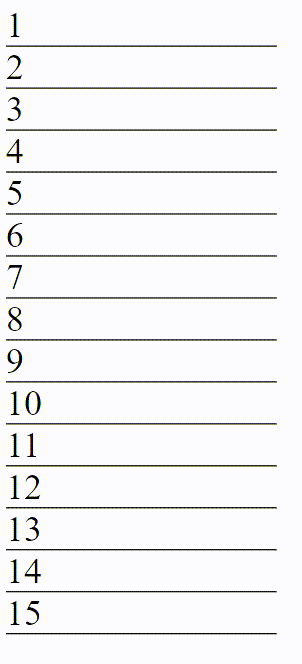

## open_close_spoiler.html
### Description
This is a page in which the hidden list opens when the button is clicked or vice versa
### Screenshot
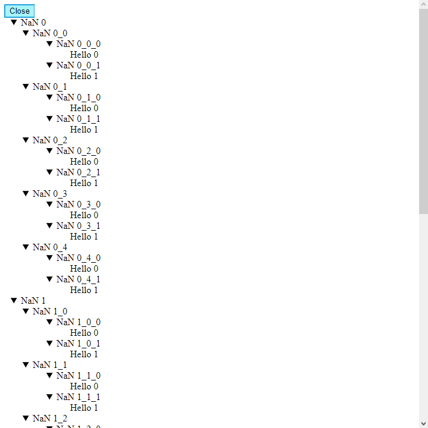

## preloader.html
### Description
This is a page that implements an example of a page preloader
### Screenshot
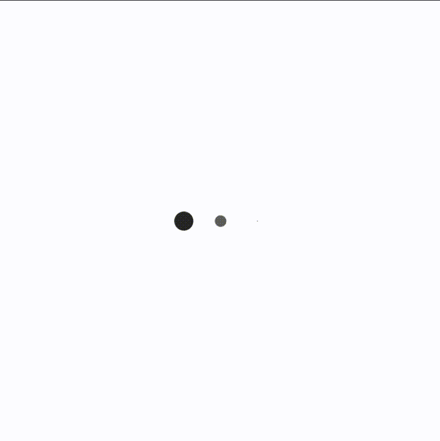

## privetstvie.html
### Description
This is the page where the greeting is displayed based on the local time
### Screenshot
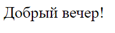

## progressBar.html
### Description
This is a page in which the position bar of the client's visible area is displayed at the top of the page
### Screenshot

## serverTime.html
### Description
This is a page that displays the local current time, updated every second
### Screenshot
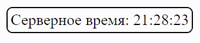

## simpleTyping.html
### Description
This is a page where the specified words are reprinted in the code over time
### Screenshot
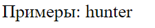

## snowMode.html
### Description
This is the page where the animation of falling snow is made
### Screenshot

## sortTable.html
### Description
This is a page that shows an example of sorting data in a column in ascending/descending order
### Screenshot
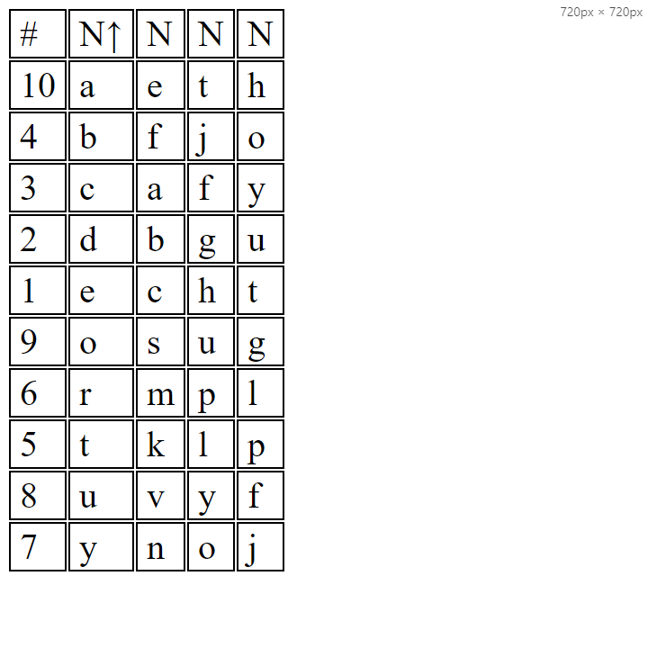

## switcher.html
### Description
This is the page where the switch is shown
### Screenshot

## switcherLang.html
### Description
This is a page that shows an example of changing the site language
### Screenshot
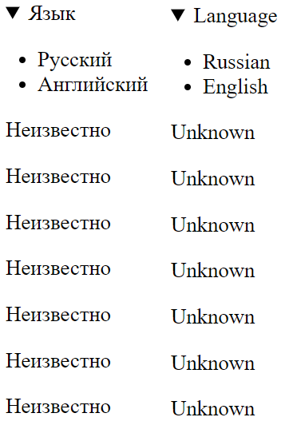

## switcherThemes.html
### Description
This is a page that shows an example of switching the theme of pages
### Screenshot

## timer.html
### Description
This is a page that shows an example of a timer that shows the remaining time to the specified one. For example, the amount of time remaining until the new year
### Screenshot
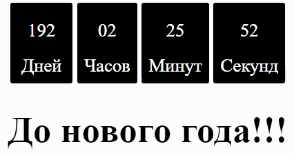

## workingSiteTime.html
### Description
This is a page that shows an example of a stopwatch that will enter a countdown from the specified time in the code to the current moment, thereby showing, for example, the operation of the site on the network
### Screenshot
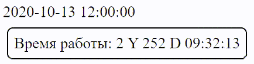

## Authors

- [Dmitriy303](https://github.com/rusnakdima)

## License

This project is licensed under the [License](LICENSE.MD).

## Contact

If you have any questions or comments about this project, please feel free to contact us at [contact email](rusnakdima03@gmail.com).